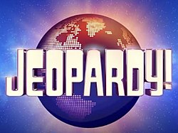

# **Winning Strategies for Jeopardy!**        

## **Origin**
[Jeopardy!](http://jeopardy.com) is one of the most popular and longest running game shows on American television. [Several editions](https://en.wikipedia.org/wiki/Jeopardy!) of Jeopardy! have appeared since the 1960s, with the most recent version running from 1984 to the present (as of January, 2021). Alex Trebek hosted from 1984 until his death in 2020. I've always enjoyed trivia, and I had the opportunity to be a (losing!) contestant on Jeopardy! in 2007--something I had always wanted to do. It was a great experience.

In 2019 [James Holzhauer](https://en.wikipedia.org/wiki/James_Holzhauer) had a string of high-scoring games that broke previous scoring records, using several strategies that differed from typical game play. I developed this project based on the idea of exploring potential winning strategies that can be gleaned from analyzing Jeopardy! game data.

---

## **Data Source**

The [J! Archive](http://j-archive.com) is a fan-created web site that maintains an extensive archive of Jeopardy! shows. I compiled the data set for the project from this site using Python and BeautifulSoup. The data set contains about 6,200 of the available games beginning in Season 6 (September, 1989). Games from earlier seasons are available in the archive, but they tend to be less complete. I discarded a small number games in a non-standard format or with other irregularities.

The data set includes 375,000 clues and answers and 81,000 distinct categories, plus the order of clues chosen, all round scores, final scores, Daily Double locations/wagers, and Final Jeopardy! wagers. Currently the application touches on only a few of the many interesting aspects of the data available in the data set.

---

## **Acknowledgments**

This project would not be possible without the work of the fans who maintain the J! Archive. Thanks to them and to all the people at Jeopardy Productions, Inc. and Sony Pictures who make Jeopardy! so much fun for viewers and contestants alike.

My incredibly helpful and patient instructors and classmates in DS Cohort 4 at NSS have also been instrumental in completing this project. You're the best! Thank you all.